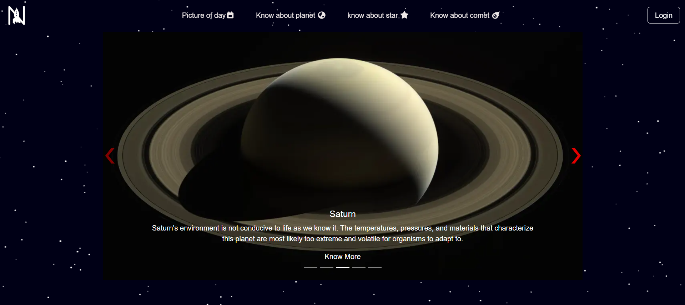
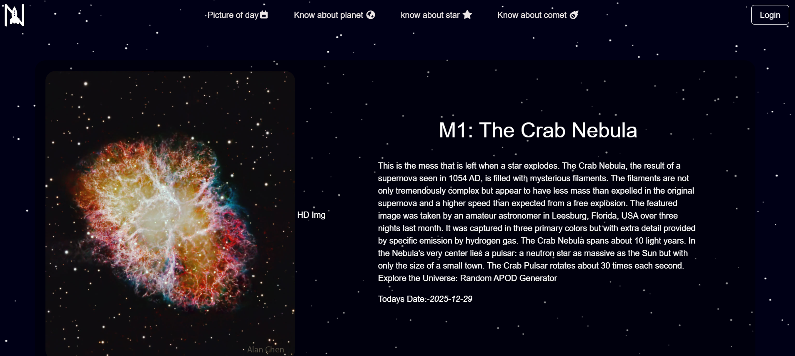
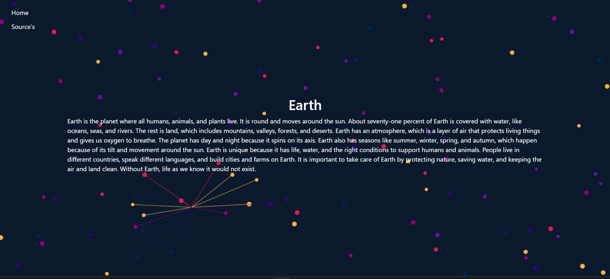

# 🌟 Nakshatra

 

---

## 📌 Project Overview

**Nakshatra** is a **dynamic, full-stack JavaScript web application** built with **Node.js**, **Express.js**, and **EJS templating**.  
It fetches real-time astronomy data from the **NASA API**, renders dynamic views, and provides an interactive, responsive user experience.  

> This project demonstrates skills in **server-side rendering, API integration, responsive design, and full-stack JavaScript development**.

---

## ✨ Key Features

- 🔹 **Dynamic web application** with server-side rendering  
- 🔹 **Express.js** server with clean routing  
- 🔹 **EJS templating** for dynamic views  
- 🔹 **Bootstrap 5** for responsive and modern UI  
- 🔹 **NASA API integration** for fetching astronomy data (images, info)  
- 🔹 **Static assets** served from `public/` folder (CSS, JS, images)  
- 🔹 **Interactive components**: forms, navigation bars, buttons styled with Bootstrap  
- 🔹 **Modular and extendable project structure**  
- 🔹 **Fully responsive design** for desktop, tablet, and mobile  
- 🔹 **Easy to deploy and maintain**

---

 ## 🛠️ Tech Stack

  **Backend**: Node.js, Express.js  
  **Templating**: EJS  
  **Frontend**: HTML, CSS, JavaScript  
  **API**: NASA API for real-time astronomy data  

---

## 🔮 Future Plans

1. **Admin Login:** Create a secure login page for authorized users to add or modify facts about planets, stars, comets, etc., including daily information.

2. **Authentication & Authorization:** Implement proper authentication and authorization to protect admin functionalities.

🟢 3.  **Enhanced Landing Page:** Build a dedicated landing page with additional astronomy information instead of relying on external sources.

4. **Search & Filter:** Add search and filter functionality to quickly find specific celestial objects, facts, or images.

🟢 5. **User Dashboard:** Create a dashboard where visitors can view the most recent updates, trending celestial events, or daily astronomy facts.

6. **Interactive Visuals:** Integrate charts, graphs, or animations (e.g., planet positions, star maps) for a more engaging experience.

7. **Notifications & Updates:** Send daily or weekly astronomy updates via email or notifications for registered users.

🟢 8. **API Expansion:** Integrate additional APIs (e.g., space news, live satellite data, astronomy events) to make the app richer.

9. **Mobile Optimization:** Enhance mobile responsiveness and potentially create a progressive web app (PWA) for offline access.

